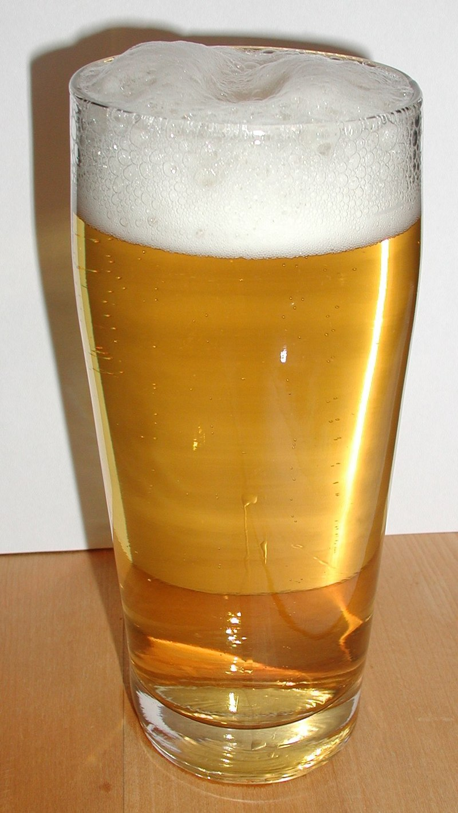

```{r setup, include=FALSE}
knitr::opts_chunk$set(
  echo = TRUE,
  comment = "#>",
  collpase = TRUE,
  warning = FALSE,
  message = FALSE
  )

beauty_number <- function(x){format(x, digits=2, big.mark=",")}

library(tidyverse)

small_diamonds <- diamonds %>% 
  filter(carat <= 2.5)

n <- nrow(small_diamonds)
```

## Ejemplo de diamantes

Ahora tenemos `r n` diamantes. Por tanto solamente hay  `r nrow(diamonds) - n` diamantes que superen los 2.5 **kilates**.

La distribución del resto de diamantes es la siguiente:

```{r plot_diamonds, echo=FALSE}
small_diamonds %>%
  ggplot(aes(carat)) +
  geom_freqpoly(binwidth=0.01)
```

# Guía para formatear los textos

---

*Este texto está en itálica* o también _Este otro texto está en cursiva_

**Este texto está en negrita** o también __Este otro texto está lo está__

En caso de querer escribir código `colocamos un backstick`

Si queremos elevar podemos escribir x^2^ o para subíndices x~2~

# Guía para crear encabezados

---

# Primer nivel de cabecera

## Segundo nivel de cabecera

### Tercer nivel de cabecera

# Guía para crear listas

---

* Primer ítem

* Segundo ítem

  * Segundo ítem A
  
  * Segundo ítem B
  
* Tercer ítem

1. Primer ítem numerado

2. Segundo ítem numerado

# Guía de links e imágenes

---

<https://www.linkedin.com/in/jesusmudarralujan/>

[Perfil de LinkedIn de Jesús](https://www.linkedin.com/in/jesusmudarralujan/)



# Guía de Tablas

---

Primera Cabecera | Segunda Cabecera
-----------------|------------------
Contenido 1.1    | Contenido 1.2
Contenido 2.1    | Contenido 2.2
Contenido 3.1    | Contenido 3.2

# Guía para el código

---

```{r summary_cars, eval=TRUE, echo=FALSE, results='asis'}
print(xtable::xtable(head(mtcars, 10),
                     caption = "Una tabla estilizada con xtable"),
      type = "html")

knitr::kable(head(mtcars, 10),
             caption = "Una tabla estilizada con knitr")
      
mtcars %>%
  ggplot(aes(mpg)) +
  geom_histogram()
```

```{r load_data, cache.extra=file.info("../data/cars.csv")}
data <- read_csv("../data/cars.csv")
```

```{r process_data, cache=TRUE}
processed.data <- data %>% 
  filter(mpg < 20) %>% 
  mutate(new_var=mpg/disp)

knitr::kable(processed.data)
```

El número $\pi$ es: `r beauty_number(pi)`, y un número muy grande sería `r beauty_number(123456.789)` y un número con muchos decimales `r beauty_number(0.125678)`

# Uso de los parámetros en YAML.

```{r}
mpg %>% filter(class==params$car_class) %>% 
  ggplot(aes(x=displ, y=hwy)) +
  geom_point() +
  geom_smooth(se=FALSE)
```


El inicio de la pandemia ocurrió el `r params$start` y terminó en `r params$end`.


